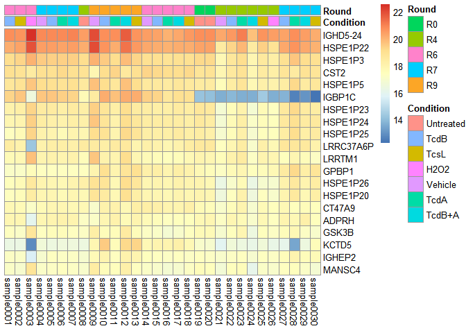

DESeq2 Analysis
================
Ananya Nimbalkar
2024-04-24

- [1 Introduction](#1-introduction)
- [2 Data](#2-data)
- [3 Necessary Packages](#3-necessary-packages)
- [4 Load Data](#4-load-data)
  - [4.1 Data Preparation](#41-data-preparation)
- [5 Create DESeqDataSet Object](#5-create-deseqdataset-object)
- [6 Initial Plots](#6-initial-plots)
  - [6.1 Line Graph](#61-line-graph)
- [7 Differential Expression
  Analysis](#7-differential-expression-analysis)
  - [7.1 Log Fold Change](#71-log-fold-change)
  - [7.2 Speed-up and Parallelization
    Thoughts](#72-speed-up-and-parallelization-thoughts)
  - [7.3 p-values & Adjusted p-values](#73-p-values--adjusted-p-values)
  - [7.4 Independent Hypothesis
    Weighting](#74-independent-hypothesis-weighting)
- [8 Visual Exploration of Results](#8-visual-exploration-of-results)
  - [8.1 MA-plot](#81-ma-plot)
    - [8.1.1 Alternative Shrinkage
      Estimators](#811-alternative-shrinkage-estimators)
  - [8.2 Plot Counts](#82-plot-counts)
  - [8.3 Results Columns](#83-results-columns)
- [9 Data Transformations &
  Visualizations](#9-data-transformations--visualizations)
  - [9.1 Count Data Transformations](#91-count-data-transformations)
  - [9.2 Transformed Standard Deviation
    Plots](#92-transformed-standard-deviation-plots)
  - [9.3 Heatmap of Counts Matrix](#93-heatmap-of-counts-matrix)
  - [9.4 PCA Plot](#94-pca-plot)
- [10 Variations to Standard
  Workflow](#10-variations-to-standard-workflow)
  - [10.1 Wald Test](#101-wald-test)
  - [10.2 Interactions](#102-interactions)
  - [10.3 Likelihood Ratio Test](#103-likelihood-ratio-test)
- [11 Additional Plots](#11-additional-plots)
  - [11.1 Boxplot](#111-boxplot)
  - [11.2 Dispersion Plot](#112-dispersion-plot)
  - [11.3 Alternate MA-plots](#113-alternate-ma-plots)
  - [11.4 P-Value Histogram](#114-p-value-histogram)
  - [11.5 Volcano Plots](#115-volcano-plots)
- [12 Conclusion](#12-conclusion)

# 1 Introduction

This notebook is going to follow the DESeq2 tutorial that can be found
on bioconductor, specifically at:

<https://www.bioconductor.org/packages/release/bioc/vignettes/DESeq2/inst/doc/DESeq2.html#count-matrix-input>

Portions of text have been inputted in this markdown notebook.

\*Conclusions not provided.

Differential expression analysis is going to be conducted.

# 2 Data

The data that is going to be used is the counts matrix that was
generated using tximport, as well as the metadata that provides details
for each of the samples.

counts_matrix.csv is a file that represents the number of reads (counts)
mapped to each gene across various samples.

10051_NM_metadata.csv includes information about each samples, such as
experimental conditions.

A series of dataframes and figures will be produced using DESeq2.

# 3 Necessary Packages

There are several packages that are required for this analysis, and the
code to download it will be shown when it is needed to be used. First we
can download the DESeq2 package.

``` r
if (!require("BiocManager", quietly = TRUE))
  install.packages("BiocManager")

BiocManager::install("DESeq2")
```

    ## package 'DESeq2' successfully unpacked and MD5 sums checked
    ## 
    ## The downloaded binary packages are in
    ##  C:\Users\anani\AppData\Local\Temp\Rtmp0qnp5r\downloaded_packages

# 4 Load Data

The counts matrix and metadata need to be read into RStudio to begin the
analysis. For the DESeq2 analysis to run, we need to drop the gene ID
columns in both files so only the numeric data remains.

``` r
library("DESeq2")
library(readr)  # for read_csv
```

``` r
# Load counts matrix
counts_file_path <- "D:\\MarkhamLab\\Analysis\\counts_matrix.csv"
counts <- read_csv(counts_file_path, col_names = TRUE)
rownames(counts) <- counts$...1 # Replace '...1' with the actual name of the gene ID column if necessary

# Create copy of counts matrix with gene names
counts_with_gene_names <- counts
counts <- counts[,-1] # Drop the gene ID column so that only numeric count data remains

# Load metadata
metadata_file_path <- "D:\\MarkhamLab\\Analysis\\10051_NM_metadata.csv"
metadata <- read_csv(metadata_file_path)
rownames(metadata) <- metadata$Sample
metadata <- metadata[,-1] # Remove the 'Sample' column after setting it as row names
```

As seen above, a copy of the counts matrix is created with the gene
names to be used in future plots such as a heatmap.

## 4.1 Data Preparation

Both files that were read in need to be in the same format, so the rows
and columns need to be lined up. Here, the rows in the metadata are
renamed to match the column names in the counts matrix. Then, a check is
done to ensure the data is properly aligned.

``` r
# Rename rownames in metadata to match the column names in counts
rownames(metadata) <- colnames(counts)

# Check that the sample names in the counts matrix and metadata match
stopifnot(all(colnames(counts) == rownames(metadata)))
```

The metadata file contains 7 different types of conditions across the 30
samples. The ‘Condition’ column of this file can be adjusted to be a
factor with specific levels, setting ‘Untreated’ as the reference level.
This is necessary for the differential expression analysis, as it
defines the baseline condition against which other conditions will be
compared.

``` r
# which contains the conditions for each sample
metadata$Condition <- factor(metadata$Condition,
                             levels = c("Untreated", "TcdB", "TcsL", "H2O2", "Vehicle", "TcdA", "TcdB+A"))

# Now 'Untreated' is the first level and thus the reference level by default
# If you want to explicitly set it as the reference you can use relevel
metadata$Condition <- relevel(metadata$Condition, ref = "Untreated")
```

# 5 Create DESeqDataSet Object

Now, we can create the DESeqDataSet object, which is the core data
structure used by DESeq2 for storing the count data, metadata, and the
design formula for the analysis.

‘DESeqDataSetFromMatrix’, the function used, is a constructor function
that creates the object from a matrix of count data. The counts matrix
and metadata are provided as the inputs, as well as a design formula
that specifies how the counts are expected to vary according to the
experimental conditions.

The ‘countData’ argument expects the matrix of count data. Each row of
this matrix represents a gene and each column represents a sample. Here,
we use the variable ‘counts’ which contains this matrix with the gene
IDs removed from the columns and is now just a numeric matrix of read
counts.

The ‘colData’ parameter is used to provide metadata associated with the
samples. The ‘DataFrame(metadata)’ part converts ‘metadata’ into a
DataFrame, which is a data structure required by ‘DESeq2’ for the column
data.

The ‘design’ argument specifies the formula that models how the counts
depend on the experimental conditions. In this case, ‘~ Condition’ means
the differential expression analysis should be performed with respect to
the ‘Condition’ variable in the metadata. This means that DESeq2 will
analyze the count data to identify genes whose expression changes
significantly across the different levels of the ‘Condition’ variable.

``` r
# Create the DESeqDataSet object
dds <- DESeqDataSetFromMatrix(countData = counts,
                              colData = DataFrame(metadata),
                              design = ~ Condition) # Replace 'Condition' with the actual condition variable name if different
```

# 6 Initial Plots

Next, we can produce some preliminary plots to determine what data we
are working with. \## Histogram

First, we can plot a histogram that depicts the counts per conditions.

We need to prepare the metadata so the row names of the DataFrame have a
standardized format starting with ‘sample’ followed by a zero-padded
numerical identifier, to ensure ease of identification and
compatibility.

``` r
# Set row names of 'metadata' to the 'Sample' column values
rownames(metadata) <- paste0("sample", sprintf("%04d", as.integer(rownames(metadata))))
```

The raw count data of the matrix is extracted from the ‘DESeqDataSet’
object, ‘dds’. This matrix has genes as rows and samples as columns.

``` r
# Get raw counts from DESeqDataSet object
raw_counts <- counts(dds)
```

A for loop is created, iterating over each unique condition found in the
‘metadata’ DataFrame. Within the loop, it first identifies the samples
that belong to the current condition being iterated over, then subsets
the counts matrix to only include columns (samples) corresponding to the
current condition.

‘gene_counts_sum’ sums the counts across all samples for each gene,
resulting in a single sum per gene that represents its overall
expression level within the current condition.

Using the ‘ggplot2’ library, a histogram of the summed counts per gene
is created for each condition.

``` r
library(ggplot2)

# Iterate over each unique condition
for (condition in unique(metadata$Condition)) {
  # Subset sample names for the current condition
  samples_in_condition <- rownames(metadata)[metadata$Condition == condition]
  
  # Subset counts for samples in the current condition
  counts_in_condition <- raw_counts[, samples_in_condition]
  
  # Calculate the sum of counts per gene across all samples in the condition
  gene_counts_sum <- rowSums(counts_in_condition)
  
  # Plot histogram of gene counts sum for the current condition
  p <- ggplot(data = data.frame(gene_counts_sum), aes(x = gene_counts_sum)) +
    geom_histogram(bins = 30, fill = "blue", color = "black") + # Adjust bins as needed
    ggtitle(paste("Histogram of gene counts for", condition)) +
    xlab("Sum of counts per gene") +
    ylab("Number of genes") +
    coord_cartesian(xlim = c(0, 1000)) # Use coord_cartesian to set x-axis limits
  
  # Print the plot
  print(p)
}
```

<!-- --><!-- --><!-- --><!-- --><!-- --><!-- --><!-- -->

## 6.1 Line Graph

A line graph that shows the average count per gene for each condition is
plotted.

An empty DataFrame is initialized that will store the average count per
gene for each condition after computation.

``` r
# Calculate average count per gene for each condition
average_counts_per_condition <- data.frame()
```

The for loop iterates over each unique condition present in the
‘metadata’ DataFrame. For each condition, it performs the following
steps:

1.  Identifies samples that belong to the current condition by matching
    the condition name in ‘metadata’ and then subsets the raw count
    data, ‘raw_counts’ to include only those samples.

2.  Calculates the average count per gene across the samples for the
    current condition using ‘rowMeans()’. This gives a measure of the
    central tendency of expression levels for each gene within the
    condition.

For each condition, a temporary DataFrame called ‘condition_data’ is
created, where it consists of 3 columns: a gene identifier ‘Gene’, the
average count for that gene ‘AverageCount’, and the condition name
‘Condition’. Note the gene identifier is a sequence of numbers from 1 to
the number of genes, which are the rows in ‘raw_counts’.

This DataFrame is appended to the ‘average_counts_per_condition’
DataFrame.

``` r
for (condition in unique(metadata$Condition)) {
  samples_in_condition <- rownames(metadata)[metadata$Condition == condition]
  counts_in_condition <- raw_counts[, samples_in_condition]
  
  # Calculate the average count per gene
  average_counts <- rowMeans(counts_in_condition)
  
  # Prepare a data frame for plotting
  condition_data <- data.frame(Gene = 1:nrow(raw_counts), 
                               AverageCount = average_counts, 
                               Condition = condition)
  average_counts_per_condition <- rbind(average_counts_per_condition, condition_data)
}
```

‘ggplot2’ is used to create a line plot of the average counts per gene
for each condition. The x-axis represents genes, labeled by their order
of appearance in the dataset. The y-axis shows the average count per
gene. Each condition is differentiated by a different color. The line
graph is saved as ‘average_gene_counts_by_condition.png’.

``` r
# Open a PNG device
png("D:\\MarkhamLab\\Analysis\\average_gene_counts_by_condition.png", width = 800, height = 600)

# Plot
ggplot(average_counts_per_condition, aes(x = Gene, y = AverageCount, color = Condition)) +
  geom_line() +
  theme_minimal() +
  labs(title = "Average Gene Counts by Condition", x = "Gene (ordered by appearance)", y = "Average Count") +
  scale_color_brewer(palette = "Set1") +
  theme(axis.text.x = element_text(angle = 90, hjust = 1))

# Close the device
dev.off()
```

    ## png 
    ##   2

``` r
knitr::include_graphics("D:\\MarkhamLab\\Analysis\\average_gene_counts_by_condition.png")
```

<!-- -->

# 7 Differential Expression Analysis

To do the differential expression analysis, we first have to pre-filter
in order to remove genes with low read counts across samples. This is
because genes with very low counts are unlikely to be statistically
significant, and their inclusion can increase multiple testing burden
and reduce the overall power to detect differentially expressed genes.

We set the smallest group size for filtering to 3 and create a logical
matrix where entires are ‘TRUE’ if the count is 10 or more and ‘FALSE’
if otherwise. The ‘dds’ variable subsets the ‘DESeqDataSet’ object,
keeping only the genes (rows) that passed the pre-filtering criteria.

``` r
# Pre-filtering
smallestGroupSize <- 3
keep <- rowSums(counts(dds) >= 10) >= smallestGroupSize
dds <- dds[keep,]
```

After the pre-filtering, the differential expression analysis is
performed using the DESeq2 pipeline.

DESeq(dds) estimates size factors, to account for differences in
sequencing depth across samples, estimates dispersion values for each
gene, and then tests for differential expression. The function returns a
modified ‘DESEqDataSet’ object including the results of the analysis.
‘res’ extracts the results of the differential expression analysis from
the ‘DESeqDataSet’ object. This includes log2 fold changes, p-values,
and adjusted p-values for each gene. The results are then saved as a
.csv file titled ‘results_table’.

``` r
# Differential Expression Analysis
# Run the DESeq pipeline
dds <- DESeq(dds)
res <- results(dds)
res
```

    ## log2 fold change (MLE): Condition TcdB.A vs Untreated 
    ## Wald test p-value: Condition TcdB.A vs Untreated 
    ## DataFrame with 20994 rows and 6 columns
    ##        baseMean log2FoldChange     lfcSE      stat     pvalue      padj
    ##       <numeric>      <numeric> <numeric> <numeric>  <numeric> <numeric>
    ## 1       8.32494       1.072610  1.115488  0.961561 0.33627022   0.99996
    ## 2     552.12610       0.063612  0.311777  0.204031 0.83832947   0.99996
    ## 3     123.51235       0.192904  0.336502  0.573261 0.56646768   0.99996
    ## 4      57.14180      -1.757401  0.608106 -2.889956 0.00385296   0.99996
    ## 5     290.66567       0.122900  0.240668  0.510660 0.60958946   0.99996
    ## ...         ...            ...       ...       ...        ...       ...
    ## 20990   81.2865      0.2645258  0.372526  0.710086   0.477651   0.99996
    ## 20991 2688.4758     -0.0737044  0.132845 -0.554814   0.579022   0.99996
    ## 20992 4647.1167      0.3048455  0.251544  1.211899   0.225551   0.99996
    ## 20993 9068.6247      0.2544904  0.227136  1.120434   0.262529   0.99996
    ## 20994 3757.6762     -0.0991481  0.157604 -0.629095   0.529287   0.99996

``` r
write.csv(as.data.frame(res), 
          file="D:\\MarkhamLab\\Analysis\\results_table.csv")
```

## 7.1 Log Fold Change

A Log Fold Change (LFC) can be performed, as it is useful for
visualization and ranking of genes. The package ‘apeglm’ is needed
because it is an advanced statistical package designed for shrinking log
fold changes in high-throughput biological data, improving stability and
interpretability.

``` r
# Install apeglm for log fold change below
if (!requireNamespace("BiocManager", quietly = TRUE))
  install.packages("BiocManager")
BiocManager::install("apeglm")
```

Here, we identify the coefficient to be “Condition_TcdB.A_vs_Untreated”,
for which LFC shrinkage will be applied. This is done by finding the
position of this contrast in the results names of the ‘DESeqDataSet’
object ‘dds’ with ‘resultsNames(dds)’.

``` r
library(apeglm)

# 4. LFC
# Log fold change shrinkage for visualization and ranking
resultsNames(dds)
```

    ## [1] "Intercept"                      "Condition_TcdB_vs_Untreated"   
    ## [3] "Condition_TcsL_vs_Untreated"    "Condition_H2O2_vs_Untreated"   
    ## [5] "Condition_Vehicle_vs_Untreated" "Condition_TcdA_vs_Untreated"   
    ## [7] "Condition_TcdB.A_vs_Untreated"

``` r
# First, find the position of "Condition_TcdB.A_vs_Untreated" in the resultsNames(dds)
coefPosition <- which(resultsNames(dds) == "Condition_TcdB.A_vs_Untreated")
```

The ‘lfcShrink’ function is then called on the ‘dds’ object, specifying
the coefficient position of the contrast of interest and the shrinkage
method.

LFC shrinkage methods like ‘apeglm’ are designed to provide more precise
and reliable estimates of fold changes, particularly when dealing with
noisy data.

The result is then stored in ‘resLFC’, which contains the shrunken
log2fold changes among other statistics for each gene. This is saved as
‘results_table_LFC.csv’.

``` r
# Now use this position with lfcShrink
resLFC <- lfcShrink(dds, coef=coefPosition, type="apeglm")
resLFC
```

    ## log2 fold change (MAP): Condition TcdB.A vs Untreated 
    ## Wald test p-value: Condition TcdB.A vs Untreated 
    ## DataFrame with 20994 rows and 5 columns
    ##        baseMean log2FoldChange      lfcSE     pvalue      padj
    ##       <numeric>      <numeric>  <numeric>  <numeric> <numeric>
    ## 1       8.32494    8.26895e-07 0.00144269 0.33627022   0.99996
    ## 2     552.12610    6.87619e-07 0.00144268 0.83832947   0.99996
    ## 3     123.51235    1.75443e-06 0.00144268 0.56646768   0.99996
    ## 4      57.14180   -5.12222e-06 0.00144270 0.00385296   0.99996
    ## 5     290.66567    2.19812e-06 0.00144267 0.60958946   0.99996
    ## ...         ...            ...        ...        ...       ...
    ## 20990   81.2865    1.95199e-06 0.00144269   0.477651   0.99996
    ## 20991 2688.4758   -4.35589e-06 0.00144261   0.579022   0.99996
    ## 20992 4647.1167    4.88584e-06 0.00144268   0.225551   0.99996
    ## 20993 9068.6247    5.03346e-06 0.00144267   0.262529   0.99996
    ## 20994 3757.6762   -4.17116e-06 0.00144264   0.529287   0.99996

``` r
write.csv(as.data.frame(resLFC), 
          file="D:\\MarkhamLab\\Analysis\\results_table_LFC.csv")
```

## 7.2 Speed-up and Parallelization Thoughts

The above steps usually take less than 30 seconds to run. However,
parallelized computation can be used to speed up the process. We need to
install ‘BiocParallel’, which facilitates parallel computing across
Bioconductor packages.

``` r
# 5. Speed-up and parallelization thoughts
if (!requireNamespace("BiocManager", quietly = TRUE))
  install.packages("BiocManager")
BiocManager::install("BiocParallel")
```

Then we can register a parallel backend using ‘register(SnowParam(4))’.
‘SnowParam’ is suggested for Windows systems, specifying that 4 cores
should be used for parallel processing. This setup allows subsequent
operations that are capable of parallelizations to run more efficiently
by utilizing multiple cores. If using a Mac, ‘MulticoreParam’ will work.

``` r
library("BiocParallel")

# For windows, use SnowParam, not MulticoreParam: register(MulticoreParam(4))
register(SnowParam(4))
```

## 7.3 p-values & Adjusted p-values

The results, ‘res’, can be ordered by the smallest p-value, to help
quickly identify the most statistically significant changes in gene
expression.

A summary of ‘res’ is printed, providing an overview of the analysis
results, and then it is saved as ‘summarized_results.csv’.

``` r
# 6. p-values & adjusted p-values
resOrdered <- res[order(res$pvalue),]

summary(res)
```

    ## 
    ## out of 20994 with nonzero total read count
    ## adjusted p-value < 0.1
    ## LFC > 0 (up)       : 3, 0.014%
    ## LFC < 0 (down)     : 1, 0.0048%
    ## outliers [1]       : 87, 0.41%
    ## low counts [2]     : 0, 0%
    ## (mean count < 1)
    ## [1] see 'cooksCutoff' argument of ?results
    ## [2] see 'independentFiltering' argument of ?results

``` r
write.csv(as.data.frame(res), 
          file="D:\\MarkhamLab\\Analysis\\summarized_results.csv")
```

The number of genes that have an adjusted p-value less than 0.1 can be
calculated. Adjusted p-values are used to control the False Discovery
Rate (FDR), and counting genes below a certain FDR threshold helps
quantify the number of findings considered statistically significant.

``` r
# Shows how many adjusted p-values were less than 0.1
sum(res$padj < 0.1, na.rm=TRUE)
```

    ## [1] 4

The results can be further filtered so only those with an adjusted
significance value of 0.05 are extracted. These results are saved as
‘summarized_results_pvalue_cutoff.csv’.

``` r
res05 <- results(dds, alpha=0.05)
summary(res05)
```

    ## 
    ## out of 20994 with nonzero total read count
    ## adjusted p-value < 0.05
    ## LFC > 0 (up)       : 3, 0.014%
    ## LFC < 0 (down)     : 0, 0%
    ## outliers [1]       : 87, 0.41%
    ## low counts [2]     : 0, 0%
    ## (mean count < 1)
    ## [1] see 'cooksCutoff' argument of ?results
    ## [2] see 'independentFiltering' argument of ?results

``` r
write.csv(as.data.frame(res05), 
          file="D:\\MarkhamLab\\Analysis\\summarized_results_pvalue_cutoff.csv")
```

Lastly, we calculate how many genes meet the criterion of having an
adjusted p-value less than 0.05.

``` r
sum(res05$padj < 0.05, na.rm=TRUE)
```

    ## [1] 3

## 7.4 Independent Hypothesis Weighting

Independent Hypothesis Weighting (IHW) is a method that improved power
in multiple hypothesis testing by assigning different weights to each
test based on covariates that affect the power of the tests but are
independent of the test outcomes.

We need to install the IHW package in order to proceed.

``` r
# 7. Independent hypothesis weighting
if (!requireNamespace("BiocManager", quietly = TRUE))
  install.packages("BiocManager")
BiocManager::install("IHW")
```

IHW is run with DESeq2, which obtains the results of differential
expression analysis while applying the IHW methof. The ‘filterFun=ihw’
argument specifies that IHW should be used for adjusting p-values. The
summary of this is printed, providing an overview of the number of genes
found significant under various thresholds. It is saved as
‘summarized_results_IHW.csv’.

``` r
library("IHW")
resIHW <- results(dds, filterFun=ihw)
summary(resIHW)
```

    ## 
    ## out of 20994 with nonzero total read count
    ## adjusted p-value < 0.1
    ## LFC > 0 (up)       : 1, 0.0048%
    ## LFC < 0 (down)     : 1, 0.0048%
    ## outliers [1]       : 87, 0.41%
    ## [1] see 'cooksCutoff' argument of ?results
    ## see metadata(res)$ihwResult on hypothesis weighting

``` r
write.csv(as.data.frame(resIHW), 
          file="D:\\MarkhamLab\\Analysis\\summarized_results_IHW.csv")
```

We can calculate the number of genes with an adjusted p-value below 0.1,
indiciating statistical significance at this threshold, and then
retrieve details of the IHW analysis.

``` r
sum(resIHW$padj < 0.1, na.rm=TRUE)
```

    ## [1] 2

``` r
metadata(resIHW)$ihwResult
```

    ## ihwResult object with 20994 hypothesis tests 
    ## Nominal FDR control level: 0.1 
    ## Split into 13 bins, based on an ordinal covariate

# 8 Visual Exploration of Results

Up until now, besides the preliminary plots, the results were all
numeric. Plots can be produced that showcase these findings.

## 8.1 MA-plot

MA-plots are a type of scatter plot used in bioinformatics to display
the relationship between the magnitude of gene expression changes and
the average expression levels across conditions. It plots the log ratio
(M, for minus) against the mean average (A, for arthimetic mean) of the
intensities of 2 conditions on a log scale. For RNA-seq data, the M
values typically represent log2 fold changes between 2 conditions,
indiciating how much more or less a gene is expressed relative to a
reference. The A values represent average expression levels across those
conditions.

We can first plot the raw unshrunken log2 fold changes from the
differential expression analysis, from a range of -2 to 2. Points will
be colored blue if the adjusted p-value is less than 0.1. Points that
fall out of the window are plotted as open triangles, facing up or down.

``` r
# 8. Exploring and exporting results
# log2 fold changes attributable to a given variable 
#over the mean of normalized counts for all the samples 
# in the DESeqDataSet
# Open a PNG device
png("D:\\MarkhamLab\\Analysis\\MAplot.png", width = 800, height = 600)

plotMA(res, ylim=c(-2,2))

# Close the device
dev.off()
```

    ## png 
    ##   2

``` r
knitr::include_graphics("D:\\MarkhamLab\\Analysis\\MAplot.png")
```

<!-- -->

An MA-plot of of the log2 fold changes that have been adjusted using a
shrinkage estimator, provided by the ‘apeglm’ package, can be created.
Shrinkage methods are used to improve the estimates of fold changes,
especially for genes with low counts of high variability, by borrowing
information across genes. Once again, the range is specified from -2 to
2, allowing for a direct comparison with the raw fold change plot to see
how shrinkage affects the distribution of fold changes.

``` r
# Open a PNG device
png("D:\\MarkhamLab\\Analysis\\MAplot_Shrunken_log2.png", width = 800, height = 600)

# MA-plot for the shrunken log2 fold changes
plotMA(resLFC, ylim=c(-2,2))

# Close the device
dev.off()
```

    ## png 
    ##   2

``` r
knitr::include_graphics("D:\\MarkhamLab\\Analysis\\MAplot_Shrunken_log2.png")
```

<!-- -->

### 8.1.1 Alternative Shrinkage Estimators

There are different types of shrinkage estimators that can be used. We
have been using ‘apeglm’, which is the default estimator. However, the
other types are ‘ashr’ and ‘normal’. For more details, please refer to
the bioconductor tutorial.

We list all possible constrasts that have been set up in the
‘DESeqDataSet’ object ‘dds’.

``` r
resultsNames(dds)
```

    ## [1] "Intercept"                      "Condition_TcdB_vs_Untreated"   
    ## [3] "Condition_TcsL_vs_Untreated"    "Condition_H2O2_vs_Untreated"   
    ## [5] "Condition_Vehicle_vs_Untreated" "Condition_TcdA_vs_Untreated"   
    ## [7] "Condition_TcdB.A_vs_Untreated"

The ‘ashr’ package is installed.

``` r
if (!requireNamespace("BiocManager", quietly = TRUE))
  install.packages("BiocManager")
BiocManager::install("ashr")
```

We then apply the other 2 LFC shrinkage methods to the same coefficient,
‘Condition_TcdB_vs_Untreated’, because we are interested in treated
vs. untreated.

‘normal’ uses a normal prior for shrinkage. This method assumes the LFCs
follow a normal distribution.

‘ashr’ applies adaptive shrinkage. It is designed to adaptively estimate
the distribution of effect sizes, potentially providing more accurate
shrinkage for datasets with heterogeneous effect sizes or where many
effects are truly zero.

``` r
# because we are interested in treated vs untreated, we set 'coef=2'
# For our data, means Condition_TcdB_vs_Untreated
resNorm <- lfcShrink(dds, coef=2, type="normal")
resAsh <- lfcShrink(dds, coef=2, type="ashr")
```

Each of the MA-plots are then plotted, displaying the log2 fold changes
against the average expression levels, highlighting the impact of each
shrinkage method on the stability and distribution of LFC estimates.

``` r
# Open a PNG device
png("D:\\MarkhamLab\\Analysis\\alternative_shrinkage_MAplot.png", width = 800, height = 600)

par(mfrow=c(1,3), mar=c(4,4,2,1))
xlim <- c(1,1e5); ylim <- c(-3,3)

plotMA(resLFC, xlim=xlim, ylim=ylim, main="apeglm")

plotMA(resNorm, xlim=xlim, ylim=ylim, main="normal")

plotMA(resAsh, xlim=xlim, ylim=ylim, main="ashr")

# Close the device
dev.off()
```

    ## png 
    ##   2

``` r
knitr::include_graphics("D:\\MarkhamLab\\Analysis\\alternative_shrinkage_MAplot.png")
```

<!-- -->

## 8.2 Plot Counts

As highlighted in the tutorial, it is also useful to examine the counts
of reads for a single gene across the groups. We can use the function
‘plotCounts’, which normalizes the counts by estimated size factors and
adds a pseudocount of 1/2 to allow for log scale plotting.

We find the index of the gene with the smallest adjusted p-value in the
results table ‘res’. This means the gene chosen is the one considered
most significantly differentially expressed across the conditions
tested, based on the statistical analysis performed by ‘DESeq2’. The
‘intgroup=“Condition”’ parameter specifies the counts should be grouped
by the experimental condition, which is essential for comparing the
gene’s expression levels across different treatment or states. The
created plot shows the gene with the lowest adjusted p-value and its
count data across diferent conditions specified in the ‘dds’ object.

``` r
# Open a PNG device
png("D:\\MarkhamLab\\Analysis\\PlotCounts.png", width = 800, height = 600)

plotCounts(dds, gene=which.min(res$padj), intgroup="Condition")

# Close the device
dev.off()
```

    ## png 
    ##   2

``` r
knitr::include_graphics("D:\\MarkhamLab\\Analysis\\PlotCounts.png")
```

<!-- -->

The same plot can be produced but with more customized settings, using
‘ggplot2’.

``` r
# Open a PNG device
png("D:\\MarkhamLab\\Analysis\\PlotCountsCustomized.png", width = 800, height = 600)

d <- plotCounts(dds, gene=which.min(res$padj), intgroup="Condition", 
                returnData=TRUE)
library("ggplot2")
ggplot(d, aes(x=Condition, y=count)) + 
  geom_point(position=position_jitter(w=0.1,h=0)) + 
  scale_y_log10(breaks=c(25,100,400))

# Close the device
dev.off()
```

    ## png 
    ##   2

``` r
knitr::include_graphics("D:\\MarkhamLab\\Analysis\\PlotCountsCustomized.png")
```

<!-- -->

## 8.3 Results Columns

More information regarding the results columns can be found, using the
‘mcols’ function, which retrieves the metadata columns associated with
the result object ‘res’.

The objects ‘resOrdered’ and ‘res’ are saved to a .csv file for viewing
purposes.

``` r
mcols(res)$description
```

    ## [1] "mean of normalized counts for all samples"            
    ## [2] "log2 fold change (MLE): Condition TcdB.A vs Untreated"
    ## [3] "standard error: Condition TcdB.A vs Untreated"        
    ## [4] "Wald statistic: Condition TcdB.A vs Untreated"        
    ## [5] "Wald test p-value: Condition TcdB.A vs Untreated"     
    ## [6] "BH adjusted p-values"

``` r
write.csv(as.data.frame(resOrdered), 
          file="D:\\MarkhamLab\\Analysis\\condition_treated_results.csv")

resSig <- subset(resOrdered, padj < 0.1)
resSig
```

    ## log2 fold change (MLE): Condition TcdB.A vs Untreated 
    ## Wald test p-value: Condition TcdB.A vs Untreated 
    ## DataFrame with 4 rows and 6 columns
    ##    baseMean log2FoldChange     lfcSE      stat      pvalue        padj
    ##   <numeric>      <numeric> <numeric> <numeric>   <numeric>   <numeric>
    ## 1  148.0206       20.77291  3.780708   5.49445 3.91929e-08 0.000819406
    ## 2 6174.8129        1.36486  0.287404   4.74893 2.04497e-06 0.015221607
    ## 3   17.3153        6.83077  1.442434   4.73559 2.18419e-06 0.015221607
    ## 4 1895.0750       -1.09873  0.248865  -4.41497 1.01022e-05 0.052801718

``` r
write.csv(as.data.frame(resSig), 
          file="D:\\MarkhamLab\\Analysis\\condition_treated_results_pvalue.csv")
```

# 9 Data Transformations & Visualizations

Using all of the data, we can transform and visualize it to see the
differences between various transformation functions.

## 9.1 Count Data Transformations

The raw output of the RNA-Seq data can be transformed using Variance
Stabilizing Transformation (VST) and Regularized Log Transformation
(RLT). VST is designed to stabilize the variance across the range of
mean values, which is useful when dealing with data that exhibits
different levels of sequencing depth across samples. RLT applies a
shrinkage estimator the the logarithms of count data to reduce the
variability of log-transformed counts, particularly beneficial for
low-count genes.

The ‘blind=FALSE’ argument specifies to use the experimental design
information in the transformation.

``` r
# Data Transformations & Visualization
# Count Data Transformations
# Extracting Transformed Values
vsd <- vst(dds, blind=FALSE)
rld <- rlog(dds, blind=FALSE)
head(assay(vsd), 3)
```

    ##      sample0001 sample0002 sample0003 sample0004 sample0005 sample0006
    ## [1,]   6.059342   6.018261   5.564008   6.135997   5.595745   5.577092
    ## [2,]   9.425716   9.486744  11.243594   9.260141   9.325547   9.331980
    ## [3,]   7.462469   7.309274   9.032542   7.482752   7.288794   7.423243
    ##      sample0007 sample0008 sample0009 sample0010 sample0011 sample0012
    ## [1,]   5.156871   5.156871   6.196613   5.974729   5.802460   6.201635
    ## [2,]   9.310076   9.182405   9.262994   8.666558   9.104004   8.847267
    ## [3,]   7.783683   7.125594   7.969413   7.487777   7.274621   7.082450
    ##      sample0013 sample0014 sample0015 sample0016 sample0017 sample0018
    ## [1,]   5.872167   5.905317   5.156871   5.721374   5.974884   5.906429
    ## [2,]   8.776185   8.854854   8.878548   8.896257   8.685431   8.969164
    ## [3,]   7.577405   7.273993   7.517826   7.242811   7.308035   7.273504
    ##      sample0019 sample0020 sample0021 sample0022 sample0023 sample0024
    ## [1,]   5.701411   5.780636   6.235946   6.019381   5.412924   5.703979
    ## [2,]   8.960737   9.013786   9.492449   9.340498   8.920319   9.637873
    ## [3,]   7.418367   7.558103   7.779683   7.201092   7.803464   7.804168
    ##      sample0025 sample0026 sample0027 sample0028 sample0029 sample0030
    ## [1,]   5.898754   6.212653   5.156871   5.631854   5.715502   5.378860
    ## [2,]   9.349409   9.616191   8.733583   8.786302   8.847746   8.868051
    ## [3,]   7.320349   7.649893   7.227957   7.097825   7.409583   7.627831

``` r
write.csv(as.data.frame(assay(vsd)), 
          file="D:\\MarkhamLab\\Analysis\\assay_vsd.csv")
```

## 9.2 Transformed Standard Deviation Plots

To evaluate the effectiveness of different normalization and
transformation techniques, ‘meanSDPlot’ can be produced. Here, we look
at 3 types of transformations: normal, variance-stabilized, and
regularized log-transformed data.

The ‘vsn’ and ‘hexbin’ packages need to be installed for variance
stabilization and data visualization respectively.

``` r
# Effects of Transformations on Variance
if (!requireNamespace("BiocManager", quietly = TRUE))
  install.packages("BiocManager")
BiocManager::install("vsn")

if (!requireNamespace("BiocManager", quietly = TRUE))
  install.packages("BiocManager")
BiocManager::install("hexbin")
```

Then, we can apply a normal transformation to the ‘dds’ dataset, which
takes the logarithm base 2 of the count data incremented by one. This
helps handle zeroes and stabilizes the variance by moderating the
influence of high-count genes.

``` r
# this gives log2(n + 1)
ntd <- normTransform(dds)
```

The meanSdPlots are plotted now, for each of the 3 transformations. By
plotting mean values against their standard deviations, we can visually
see if the transformation reduces variability in a way that is
proportional across the range of expression levels. This is crucial for
ensuring that downstream analyses like differential expression are
reliable and not biased by technical artifacts in the data. The
objective is to achieve homoscedasticity, where the variance is
approximately constant across all levels of gene expression, which
improves the robustness of statistical tests used later in the analysis
pipeline.

``` r
library("vsn")

# Open a PNG device
png("D:\\MarkhamLab\\Analysis\\MeanSdPlot_ntd.png", width = 800, height = 600)

meanSdPlot(assay(ntd))

# Close the device
dev.off()
```

    ## png 
    ##   2

``` r
knitr::include_graphics("D:\\MarkhamLab\\Analysis\\MeanSdPlot_ntd.png")
```

<!-- -->

``` r
# Open a PNG device
png("D:\\MarkhamLab\\Analysis\\MeanSdPlot_vsd.png", width = 800, height = 600)

meanSdPlot(assay(vsd))

# Close the device
dev.off()
```

    ## png 
    ##   2

``` r
knitr::include_graphics("D:\\MarkhamLab\\Analysis\\MeanSdPlot_vsd.png")
```

<!-- -->

``` r
# Open a PNG device
png("D:\\MarkhamLab\\Analysis\\MeanSdPlot_rld.png", width = 800, height = 600)

meanSdPlot(assay(rld))

# Close the device
dev.off()
```

    ## png 
    ##   2

``` r
knitr::include_graphics("D:\\MarkhamLab\\Analysis\\MeanSdPlot_rld.png")
```

<!-- -->

## 9.3 Heatmap of Counts Matrix

For the counts matrix, a heatmap is one of the most informative plots
that can be created. This type of visualization is commonly used in
genomic data analysis to visually assess patterns of expression across
different conditions or treatments.

We need the ‘pheatmap’ package to draw heatmaps. This package in
particular popular in the bioinformatics community due to its
flexibility and features tailored to genomic data.

``` r
# Heatmap of Count Matrix
if (!requireNamespace("BiocManager", quietly = TRUE))
  install.packages("BiocManager")
BiocManager::install("pheatmap")
```

We obtain the normalized counts from the ‘dds’ object and compute the
mean for each gene across all samples. Then, we select the top 20 genes
to plot.

``` r
# Displays top 20 genes with highest normalized counts
select <- order(rowMeans(counts(dds,normalized=TRUE)),
                decreasing=TRUE)[1:20]
```

We can create a DataFrame that selects the ‘Condition’ and ‘Round’
columns of the metadata that can be used to annotate the heatmap,
providing contextual information about the samples.

``` r
df <- as.data.frame(colData(dds)[,c("Condition","Round")])
```

The heatmap is then generated for the top 20 genes, using the normalized
transformed data. The rows and columns are not clustered.

``` r
library("pheatmap")

# Open a PNG device
png("D:\\MarkhamLab\\Analysis\\Heatmap.png", width = 800, height = 600)


pheatmap(assay(ntd)[select,], cluster_rows=FALSE, show_rownames=FALSE,
         cluster_cols=FALSE, annotation_col=df)

# Close the device
dev.off()
```

    ## png 
    ##   3

``` r
# knitr::include_graphics("D:\\MarkhamLab\\Analysis\\Heatmap.png")
```

<!-- -->

Although this heatmap provides various insights, it is more meaningful
to annotate it with the top 20 gene names. So, we can create a DataFrame
of these gene names, extract it, and append it to the heatmap.

We get the normalized counts and identify the top 20 genes, as done
before. Then, we save this into a DataFrame.

``` r
# Attempting to get gene names and their counts

# Get the normalized counts
norm_counts <- rowMeans(counts(dds, normalized=TRUE))

# Order the genes by their normalized counts
ordered_genes <- order(norm_counts, decreasing=TRUE)

# Get the names of the top 20 genes from the counts matrix with gene names
top_genes <- rownames(counts_with_gene_names)[ordered_genes[1:20]]

# Get the normalized counts of the top 20 genes
top_counts <- norm_counts[ordered_genes[1:20]]

# Create a dataframe with the gene names and their normalized counts
df_top_genes <- data.frame(Gene = top_genes, NormalizedCounts = top_counts)

# Print the dataframe
print(df_top_genes)
```

    ##         Gene NormalizedCounts
    ## 1   IGHD5-24        1869346.4
    ## 2   HSPE1P22        1381933.3
    ## 3    HSPE1P3         602593.4
    ## 4       CST2         472423.5
    ## 5    HSPE1P5         453450.5
    ## 6     IGBP1C         407553.0
    ## 7   HSPE1P23         350973.7
    ## 8   HSPE1P24         350903.9
    ## 9   HSPE1P25         315743.6
    ## 10 LRRC37A6P         298952.8
    ## 11    LRRTM1         278909.5
    ## 12     GPBP1         271849.2
    ## 13  HSPE1P26         261617.6
    ## 14  HSPE1P20         250621.6
    ## 15    CT47A9         218312.4
    ## 16     ADPRH         210018.5
    ## 17     GSK3B         186835.7
    ## 18     KCTD5         179475.6
    ## 19    IGHEP2         170268.2
    ## 20    MANSC4         170079.0

``` r
write.csv(as.data.frame(df_top_genes), 
          file="D:\\MarkhamLab\\Analysis\\heatmap_findings.csv")
```

Similarly, we generate the heatmap with the annotated gene names.

``` r
# Heatmap with gene names depicted
# Assuming 'counts_with_gene_names' exists and has gene names in the first column
# Extract gene names using the 'select' indices
gene_names <- rownames(counts_with_gene_names)[select]

# Use 'assay(ntd)' to get the normalized counts for the top 20 genes
normalized_counts_top_genes <- assay(ntd)[select,]

# Assign gene names as row names to the normalized counts matrix
rownames(normalized_counts_top_genes) <- gene_names

# Prepare the annotation data frame for the columns
df <- as.data.frame(colData(dds)[, c("Condition", "Round")])

# Open a PNG device
png("D:\\MarkhamLab\\Analysis\\Heatmap_Highest_Genes.png", width = 800, height = 600)

# Generate the heatmap with gene names displayed
pheatmap(normalized_counts_top_genes, cluster_rows=FALSE, show_rownames=TRUE,
         cluster_cols=FALSE, annotation_col=df)

# Close the device
dev.off()
```

    ## png 
    ##   3

``` r
# knitr::include_graphics("D:\\MarkhamLab\\Analysis\\Heatmap_Highest_Genes.png")
```

<!-- -->

To get the exact values of each cell on the heatmap, in this case the
number of normalized counts per gene per sample, we convert the matrix
into a DataFrame and add the gene names as the first column. This is
saved as a .csv file ready to be analyzed in detail.

``` r
# Convert the matrix to a DataFrame
normalized_counts_df <- as.data.frame(normalized_counts_top_genes)

# Add the gene names as the first column of the DataFrame
normalized_counts_df$Gene <- rownames(normalized_counts_df)

# Rearrange the DataFrame to have 'Gene' as the first column
normalized_counts_df <- normalized_counts_df[, c("Gene", setdiff(names(normalized_counts_df), "Gene"))]
normalized_counts_df <- normalized_counts_df[,-1]
# Now 'normalized_counts_df' is a DataFrame with the desired structure
print(head(normalized_counts_df))
```

    ##          sample0001 sample0002 sample0003 sample0004 sample0005 sample0006
    ## IGHD5-24   20.77185   20.62088   22.55806   20.82904   20.88645   20.86259
    ## HSPE1P22   20.11235   20.29670   21.93035   20.48785   20.41897   20.35793
    ## HSPE1P3    19.13873   19.33226   20.05971   19.53592   19.45298   19.40632
    ## CST2       19.01402   18.93667   18.45039   18.99399   19.03617   19.17042
    ## HSPE1P5    18.67322   18.91735   19.58620   19.11156   18.97290   18.91277
    ## IGBP1C     19.33039   19.56863   16.53668   19.63602   19.63192   19.39027
    ##          sample0007 sample0008 sample0009 sample0010 sample0011 sample0012
    ## IGHD5-24   20.91734   20.45717   21.99994   20.77890   20.75146   21.66949
    ## HSPE1P22   20.39675   20.17739   21.99406   20.65102   20.17059   21.27144
    ## HSPE1P3    19.39367   19.08160   20.03206   19.46792   19.12384   19.86083
    ## CST2       19.03697   18.93874   17.88194   19.06447   19.34225   18.55371
    ## HSPE1P5    18.95893   18.56240   19.71444   19.12880   18.68160   19.70107
    ## IGBP1C     19.26080   17.66201   18.43930   20.10911   19.69907   20.10651
    ##          sample0013 sample0014 sample0015 sample0016 sample0017 sample0018
    ## IGHD5-24   20.69583   20.44945   20.31639   20.03714   20.26246   20.51375
    ## HSPE1P22   20.53984   20.22229   20.12212   20.06838   20.14241   20.15716
    ## HSPE1P3    19.33029   19.03219   19.01965   18.90082   19.03395   18.96716
    ## CST2       19.03633   19.27105   19.16247   19.06440   19.07052   19.21349
    ## HSPE1P5    19.08682   18.61364   18.59334   18.49715   18.65463   18.56471
    ## IGBP1C     20.07969   19.40035   19.27185   18.69781   19.01946   19.02804
    ##          sample0019 sample0020 sample0021 sample0022 sample0023 sample0024
    ## IGHD5-24   20.73072   20.74893   20.18494   20.54449   21.08605   19.67720
    ## HSPE1P22   20.34230   20.32788   18.48124   19.34701   19.91319   18.46020
    ## HSPE1P3    19.15577   19.19775   17.80418   18.70900   19.11530   17.88881
    ## CST2       18.80270   18.87346   17.88263   18.62342   18.93787   17.84312
    ## HSPE1P5    18.44308   18.50701   17.57045   18.33310   18.73714   17.77893
    ## IGBP1C     14.18232   14.03489   13.58213   13.86996   13.59551   13.57484
    ##          sample0025 sample0026 sample0027 sample0028 sample0029 sample0030
    ## IGHD5-24   20.63076   20.47409   20.33512   20.71643   20.46146   20.14059
    ## HSPE1P22   19.41532   18.92804   20.26245   20.60666   20.23364   20.06341
    ## HSPE1P3    18.57636   18.29143   19.02828   19.56208   19.07144   18.98960
    ## CST2       18.52175   18.25625   18.82383   18.49442   18.88113   18.82458
    ## HSPE1P5    18.16904   18.07921   18.41741   19.15926   18.47718   18.65990
    ## IGBP1C     14.37723   13.64301   13.71402   12.63478   13.00065   12.22542

``` r
write.csv(as.data.frame(normalized_counts_df), 
          file="D:\\MarkhamLab\\Analysis\\heatmap_findings_per_sample.csv")
```

If you prefer to have the values directly on the heatmap for each cell,
the following code can help achieve that.

``` r
# Heatmap with values on it
library(tidyr)

# Assuming 'normalized_counts_top_genes' contains the top 20 genes with row names as gene names
# Convert the matrix to a long format for ggplot
data_long <- as.data.frame(normalized_counts_top_genes) %>%
  tibble::rownames_to_column("Gene") %>%
  tidyr::pivot_longer(-Gene, names_to = "Sample", values_to = "Value")

# Open a PNG device
png("D:\\MarkhamLab\\Analysis\\Heatmap_Highest_Genes_Counts.png", width = 800, height = 600)

# Plot heatmap with ggplot2
ggplot(data_long, aes(x = Sample, y = Gene, fill = Value)) +
  geom_tile() + # Create the heatmap tiles
  geom_text(aes(label = sprintf("%.2f", Value)), size = 3) + # Annotate with values
  scale_fill_gradient(low = "blue", high = "red") + # Color gradient
  theme_minimal() + 
  theme(axis.text.x = element_text(angle = 45, hjust = 1)) + # Improve X labels readability
  labs(fill = "Normalized\nCount") # Legend title

# Close the device
dev.off()
```

    ## png 
    ##   2

``` r
knitr::include_graphics("D:\\MarkhamLab\\Analysis\\Heatmap_Highest_Genes_Counts.png")
```

<!-- -->

``` r
# Note: Adjust 'sprintf("%.2f", Value)' to change the format of the numbers shown
```

## 9.4 PCA Plot

A Principal Component Analysis (PCA) plot shows the samples in the 2D
plane spanned by their first two principal components. This is useful
for seeing the overall effect of experimental covariates and batch
effects. Here, we take a look of Condition and Cells.

``` r
# Open a PNG device
png("D:\\MarkhamLab\\Analysis\\PCA_Plot_Samples.png", width = 800, height = 600)

# PCA Plot
# Saved as PCA_Plot_Samples
plotPCA(vsd, intgroup=c("Condition", "Cells"))

# Close the device
dev.off()
```

    ## png 
    ##   2

A more customized PCA plot can be made using ‘ggplot’.

``` r
# PCA Plot
# Saved as PCA_Plot_Samples
plotPCA(vsd, intgroup=c("Condition", "Cells"))
```

<!-- -->

``` r
# Open a PNG device
png("D:\\MarkhamLab\\Analysis\\PCA_Plot_Samples_Customized.png", width = 800, height = 600)

pcaData <- plotPCA(vsd, intgroup=c("Condition", "Cells"), returnData=TRUE)
percentVar <- round(100 * attr(pcaData, "percentVar"))
ggplot(pcaData, aes(PC1, PC2, color=Condition, shape=Cells)) +
  geom_point(size=3) +
  xlab(paste0("PC1: ",percentVar[1],"% variance")) +
  ylab(paste0("PC2: ",percentVar[2],"% variance")) + 
  coord_fixed()

# Close the device
dev.off()
```

    ## png 
    ##   2

``` r
knitr::include_graphics("D:\\MarkhamLab\\Analysis\\PCA_Plot_Samples_Customized.png")
```

<!-- -->

# 10 Variations to Standard Workflow

There are other ways to conduct the workflow, and they will be discussed
below.

## 10.1 Wald Test

The ‘dds’ object undergoes several transformations to prepare it for
differential expression testing. It uses the functions:

‘estimateSizeFactors’: To estimate size factors used to normalize the
counts data across samples, which helps to adjust for differences in
sequencing depth or RNA composition among samples.

``` r
dds <- estimateSizeFactors(dds)
```

‘estimateDispersions’: To calculate the dispersions which measure how
much the counts vary from sample to sample, which is crucial for the
statistic testing that follows.

``` r
dds <- estimateDispersions(dds)
```

‘nbinomWaldTest’: To perform a Wald test using a negative binomial model
to identify differentially expressed genes, which is one of the
hypothesis testing methods provided by ‘DESeq2’.

``` r
dds <- nbinomWaldTest(dds)
```

## 10.2 Interactions

The next steps involve combining different experimental conditions into
a single factor and updating the analysis design. Here, ‘Condition’ and
‘Cells’ are combined to create a new factor group. This is useful when
interactions between these factors are important or when you want to
simplify the model by treating each unique combination as a separate
group. The design formula of the ‘DESeqDataSet’ is updated to use this
new group factor, implying that the differential expression is to be
analyzed across these combined groups rather than separately.

``` r
# Combining 'Condition' and 'Cells' into a single factor for the analysis
dds$group <- factor(paste0(dds$Condition, dds$Cells))

# Updating the design formula to use the new 'group' factor
design(dds) <- ~ group
```

Finally, ‘DESeq2’ is run again with the updated design, and the results
are extracted for a specific contrast, in this case comparing the
combined group TcdANL.902 to H2o2NL.902. The ‘group’ parameter can be
modified to explore various groups.

``` r
# Running DESeq2 with the updated design
dds <- DESeq(dds)

# Checking the results names, which will help you specify contrasts
resultsNames(dds)
```

    ##  [1] "Intercept"                           
    ##  [2] "group_H2O2WD95732_vs_H2O2NL.902"     
    ##  [3] "group_TcdANL.902_vs_H2O2NL.902"      
    ##  [4] "group_TcdAWD95732_vs_H2O2NL.902"     
    ##  [5] "group_TcdB.ANL.902_vs_H2O2NL.902"    
    ##  [6] "group_TcdB.AWD95732_vs_H2O2NL.902"   
    ##  [7] "group_TcdBNL.902_vs_H2O2NL.902"      
    ##  [8] "group_TcdBWD95732_vs_H2O2NL.902"     
    ##  [9] "group_TcsLNL.902_vs_H2O2NL.902"      
    ## [10] "group_TcsLWD95732_vs_H2O2NL.902"     
    ## [11] "group_UntreatedNL.902_vs_H2O2NL.902" 
    ## [12] "group_UntreatedWD95732_vs_H2O2NL.902"
    ## [13] "group_VehicleNL.902_vs_H2O2NL.902"   
    ## [14] "group_VehicleWD95732_vs_H2O2NL.902"

``` r
# Check results for particular group
results(dds, name="group_TcdANL.902_vs_H2O2NL.902")
```

    ## log2 fold change (MLE): group TcdANL.902 vs H2O2NL.902 
    ## Wald test p-value: group TcdANL.902 vs H2O2NL.902 
    ## DataFrame with 20994 rows and 6 columns
    ##        baseMean log2FoldChange     lfcSE      stat      pvalue        padj
    ##       <numeric>      <numeric> <numeric> <numeric>   <numeric>   <numeric>
    ## 1       8.32494       0.888965  2.185130  0.406824 6.84137e-01 7.33261e-01
    ## 2     552.12610      -2.270521  0.430602 -5.272902 1.34283e-07 6.63725e-07
    ## 3     123.51235      -2.245801  0.458482 -4.898341 9.66494e-07 4.14930e-06
    ## 4      57.14180      -3.064602  0.924394 -3.315256 9.15591e-04 2.15291e-03
    ## 5     290.66567      -1.550208  0.330012 -4.697430 2.63455e-06 1.05201e-05
    ## ...         ...            ...       ...       ...         ...         ...
    ## 20990   81.2865     -2.5338328  0.470448 -5.386005 7.20410e-08 3.73324e-07
    ## 20991 2688.4758      0.0791611  0.220580  0.358877 7.19687e-01 7.65302e-01
    ## 20992 4647.1167      0.2245154  0.370920  0.605294 5.44984e-01 6.06849e-01
    ## 20993 9068.6247      1.3569124  0.268461  5.054415 4.31713e-07 1.96652e-06
    ## 20994 3757.6762      0.9980560  0.237052  4.210277 2.55058e-05 8.38807e-05

## 10.3 Likelihood Ratio Test

Another hypothesis test ‘DESeq2’ offers is the Likelihood Ratio Test
(LRT). Where the Wald rest uses the estimated standard error of a log2
fold change to test if it is equal to 0, the LRT examines 2 models for
the counts: a full model with a limited number of terms, and a reduced
model, where some terms of the full model are removed. In essence, this
test determines if the increased likelihood of the data using the
additional terms in the full model is more than expected if those extra
terms are truly 0.

So, here we perform LRT, obtaining the degrees of freedom from the
difference between the number of parameters in the 2 models.

``` r
# Likelihood Ratio Test
dds <- DESeq(dds, test="LRT", reduced=~1)
res <- results(dds)

write.csv(as.data.frame(res), 
          file="D:\\MarkhamLab\\Analysis\\results_table_LRT.csv")
```

# 11 Additional Plots

This final section will produce more plots that can help strengthen
previously made conclusions and/or assumptions.

## 11.1 Boxplot

Another useful visualization is a boxplot of the log-transformed Cook’s
distances. We retrieve Cook’s distances from a list of assay elements in
the ‘DESeqDataSet’ object, ‘dds’. Cook’s distance is a measure used in
statistics to identify influential data points, particularly useful in
the context of regression analysis. It can identify genes that have a
disproportionate influence on the parameter estimates of the model.

A logarithmic transformation is applied to these distances, converting
them to a log scale. This transformation is often used to manage skewed
data or to bring large range values closer together, making patterns
easier to discern on plots.

``` r
# Open a PNG device
png("D:\\MarkhamLab\\Analysis\\Cooks_Boxplot.png", width = 800, height = 600)

# Boxplot
# y-axis is log-transformed Cook's distances of the RNA-seq count data.
par(mar=c(8,5,2,2))
boxplot(log10(assays(dds)[["cooks"]]), range=0, las=2)

# Close the device
dev.off()
```

    ## png 
    ##   2

``` r
knitr::include_graphics("D:\\MarkhamLab\\Analysis\\Cooks_Boxplot.png")
```

<!-- -->

## 11.2 Dispersion Plot

A dispersion plot shows the final estimates shrunk from the gene-wise
estimates towards the fitted estimates. The amount of shrinkage can be
seen here.

``` r
# Open a PNG device
png("D:\\MarkhamLab\\Analysis\\Dispersion_Plot.png", width = 800, height = 600)

# Dispersion plot
plotDispEsts(dds)

# Close the device
dev.off()
```

    ## png 
    ##   2

``` r
knitr::include_graphics("D:\\MarkhamLab\\Analysis\\Dispersion_Plot.png")
```

<!-- -->

## 11.3 Alternate MA-plots

A series of Ma-plots using different hypotheses concerning the log fold
changes (LFC) can be plotted. The 4 different sets of results are:

‘greaterAbs’: Tests if the absolute log fold change is greater than the
threshold.

‘lessAbs’: Tests if the absolute log fold change is less than the
threshold.

‘greater’: Tests if the log fold change is greater than the threshold.

‘less’: Tests if the log fold change is less than the threshold.

A threshold of 0.5 is set that specifies the minimum log fold change
that is considered significant.

``` r
# Open a PNG device
png("D:\\MarkhamLab\\Analysis\\altHypothesis_MAplots.png", width = 800, height = 600)

par(mfrow=c(2,2),mar=c(2,2,1,1))
ylim <- c(-2.5,2.5)
resGA <- results(dds, lfcThreshold = 0.5, altHypothesis = "greaterAbs", test="Wald")
resLA <- results(dds, lfcThreshold=.5, altHypothesis="lessAbs", test="Wald")
resG <- results(dds, lfcThreshold=.5, altHypothesis="greater", test="Wald")
resL <- results(dds, lfcThreshold=.5, altHypothesis="less", test="Wald")
drawLines <- function() abline(h=c(-.5,.5),col="dodgerblue",lwd=2)
plotMA(resGA, ylim=ylim); drawLines()
plotMA(resLA, ylim=ylim); drawLines()
plotMA(resG, ylim=ylim); drawLines()
plotMA(resL, ylim=ylim); drawLines()

# Close the device
dev.off()
```

    ## png 
    ##   2

``` r
knitr::include_graphics("D:\\MarkhamLab\\Analysis\\altHypothesis_MAplots.png")
```

<!-- -->

## 11.4 P-Value Histogram

Lastly, the distribution of p-values from the differential expression
analysis can be analyzed.

We can get the average expression of genes across samples by calling
‘res\$baseMean’.

‘metadata(res)\$filterThreshold’ fetches a predefined threshold from the
metadata of the results object ‘res’. This threshold determines the
minimum average expression level required for a gene to be considered
further.

‘use’ is a logical vector indicating whether each gene’s base mean
expression surpasses the specified threshold. It yields ‘TRUE’ if it
does, ‘FALSE’ otherwise.

``` r
use <- res$baseMean > metadata(res)$filterThreshold
```

The histogram can be generated for the p-values of genes, separated into
2 groups based on whether their base mean expression passes the filter
threshold. We define 50 evenly spaced bins between 0 and 1, indicating
increments of 0.02.

``` r
# Open a PNG device
png("D:\\MarkhamLab\\Analysis\\pvalue_histogram.png", width = 800, height = 600)

h1 <- hist(res$pvalue[!use], breaks=0:50/50, plot=FALSE)
h2 <- hist(res$pvalue[use], breaks=0:50/50, plot=FALSE)
colori <- c(`do not pass`="khaki", `pass`="powderblue")

barplot(height = rbind(h1$counts, h2$counts), beside = FALSE,
        col = colori, space = 0, main = "", ylab="frequency")
text(x = c(0, length(h1$counts)), y = 0, label = paste(c(0,1)),
     adj = c(0.5,1.7), xpd=NA)

# Close the device
dev.off()
```

    ## png 
    ##   2

``` r
knitr::include_graphics("D:\\MarkhamLab\\Analysis\\pvalue_histogram.png")
```

<!-- -->

This is a useful visualization tool in RNA-seq and other omics analyses
to evaluate the impact of a base expression threshold on the statistical
characteristics of the genes studied. The visual comparison between
filtered and unfiltered data can provide insights into how such
filtering might bias or otherwise affect the results of the analysis.

## 11.5 Volcano Plots

For this analysis, volcano plots are another good visualization. It
provides quick identification of genes with large fold changes that are
statistically significant as well.

We do need to rerun the very beginning part of the code that loads all
the counts matrix and metadata in, creating the ‘dds’ and ‘res’ objects
since we made various changes with the above transformations.

``` r
library("DESeq2")
library(readr)  # for read_csv

# Load counts matrix
counts_file_path <- "D:/MarkhamLab/Analysis/counts_matrix.csv"
counts <- read_csv(counts_file_path, col_names = TRUE)
rownames(counts) <- counts$...1 # Replace '...1' with the actual name of the gene ID column if necessary
# Create copy of counts matrix with gene names
counts_with_gene_names <- counts
counts <- counts[,-1] # Drop the gene ID column so that only numeric count data remains

# Load metadata
metadata_file_path <- "D:/MarkhamLab/Analysis/10051_NM_metadata.csv"
metadata <- read_csv(metadata_file_path)
rownames(metadata) <- metadata$Sample
metadata <- metadata[,-1] # Remove the 'Sample' column after setting it as row names

# Rename rownames in metadata to match the column names in counts
rownames(metadata) <- colnames(counts)

# Check that the sample names in the counts matrix and metadata match
stopifnot(all(colnames(counts) == rownames(metadata)))

# which contains the conditions for each sample
metadata$Condition <- factor(metadata$Condition,
                             levels = c("Untreated", "TcdB", "TcsL", "H2O2", "Vehicle", "TcdA", "TcdB+A"))

# Now 'Untreated' is the first level and thus the reference level by default
# If you want to explicitly set it as the reference you can use relevel
metadata$Condition <- relevel(metadata$Condition, ref = "Untreated")


# Create the DESeqDataSet object
dds <- DESeqDataSetFromMatrix(countData = counts,
                              colData = DataFrame(metadata),
                              design = ~ Condition) # Replace 'Condition' with the actual condition variable name if different

# Differential Expression Analysis
# Run the DESeq pipeline
dds <- DESeq(dds)
res <- results(dds)
res
```

    ## log2 fold change (MLE): Condition TcdB.A vs Untreated 
    ## Wald test p-value: Condition TcdB.A vs Untreated 
    ## DataFrame with 30170 rows and 6 columns
    ##        baseMean log2FoldChange     lfcSE      stat     pvalue      padj
    ##       <numeric>      <numeric> <numeric> <numeric>  <numeric> <numeric>
    ## 1       8.32502      1.0727336  1.135495  0.944728 0.34479773  0.999768
    ## 2     552.10952      0.0635805  0.311028  0.204420 0.83802504  0.999768
    ## 3     123.50985      0.1928541  0.337478  0.571457 0.56768960  0.999768
    ## 4      57.13895     -1.7574956  0.617553 -2.845903 0.00442857  0.749896
    ## 5     290.66218      0.1228593  0.238723  0.514651 0.60679665  0.999768
    ## ...         ...            ...       ...       ...        ...       ...
    ## 30166   2688.51     -0.0737504  0.128493 -0.573966   0.565991  0.999768
    ## 30167   4647.22      0.3048151  0.248404  1.227092   0.219788  0.999768
    ## 30168      0.00             NA        NA        NA         NA        NA
    ## 30169   9068.82      0.2544557  0.223519  1.138406   0.254951  0.999768
    ## 30170   3757.73     -0.0991855  0.153306 -0.646976   0.517648  0.999768

Now to have the volcano maps clearly labeled with the gene names, we
need to create the gene mapping like how we did with the heatmap. So,
when the volcano plots are actually produced, the gene names will be
directly annotated on it.

``` r
# Need to add gene names to res to label volcano plots

# Assigning row names from counts_with_gene_names to res
rownames(res) <- rownames(counts_with_gene_names)

# Now, create the gene mapping again
res$gene <- counts_with_gene_names$...1  # Adjust the column name as needed

# Check if any gene names are missing after assignment
if (any(is.na(res$gene))) {
  stop("Some gene names could not be found. Please check the data.")
} else {
  message("Gene names successfully merged!")
}

# Check the head of res to ensure correctness
head(res)
```

    ## log2 fold change (MLE): Condition TcdB.A vs Untreated 
    ## Wald test p-value: Condition TcdB.A vs Untreated 
    ## DataFrame with 6 rows and 7 columns
    ##          baseMean log2FoldChange     lfcSE       stat     pvalue      padj
    ##         <numeric>      <numeric> <numeric>  <numeric>  <numeric> <numeric>
    ## 5S_rRNA   8.32502      1.0727336  1.135495  0.9447281 0.34479773  0.999768
    ## A1BG    552.10952      0.0635805  0.311028  0.2044203 0.83802504  0.999768
    ## A1CF    123.50985      0.1928541  0.337478  0.5714575 0.56768960  0.999768
    ## A2M      57.13895     -1.7574956  0.617553 -2.8459028 0.00442857  0.749896
    ## A2ML1   290.66218      0.1228593  0.238723  0.5146514 0.60679665  0.999768
    ## A2MP1    27.68127     -0.0405187  1.184177 -0.0342168 0.97270430  0.999768
    ##                gene
    ##         <character>
    ## 5S_rRNA     5S_rRNA
    ## A1BG           A1BG
    ## A1CF           A1CF
    ## A2M             A2M
    ## A2ML1         A2ML1
    ## A2MP1         A2MP1

The first kind of volcano plot we produce is an unlabeled one using the
‘EnhancedVolcano’ library.

``` r
# 1. Unlabeled volcano plot using EnhancedVolcano

# Load EnhancedVolcano if not already loaded
if (!requireNamespace("EnhancedVolcano", quietly = TRUE)) {
  BiocManager::install("EnhancedVolcano")
}
library(EnhancedVolcano)

# Create the volcano plot using EnhancedVolcano
png("D:\\MarkhamLab\\Analysis\\volcano_plot_unlabeled.png", width = 1200, height = 600)
EnhancedVolcano(res,
                lab = res$gene,
                x = 'log2FoldChange',
                y = 'pvalue',
                title = 'Volcano plot',
                pCutoff = 0.05,  # General p-value cutoff for significance highlighting
                FCcutoff = 2,    # General fold change cutoff for significance highlighting
                pointSize = 2.0,
                labSize = 3.0,
                labCol = 'black',
                colAlpha = 0.8,
                drawConnectors = TRUE,
                selectLab = res$pvalue < 0.01 & abs(res$log2FoldChange) > 2.5)  # More stringent criteria for labeling
dev.off()
```

    ## png 
    ##   2

``` r
knitr::include_graphics("D:\\MarkhamLab\\Analysis\\volcano_plot_unlabeled.png")
```

<!-- -->

We can now create a labeled volcano plot that shows the gene names if
their p-value is less than 0.05 and their fold change is above 2 or
below -2.

``` r
# 2. Labeled volcano plot using EnhancedVolcano

png("D:\\MarkhamLab\\Analysis\\volcano_plot_labeled.png", width = 1200, height = 600)
EnhancedVolcano(res,
                lab = res$gene,
                x = 'log2FoldChange',
                y = 'pvalue',
                title = 'Volcano plot',
                pCutoff = 0.05,  # General p-value cutoff for significance highlighting
                FCcutoff = 2,    # General fold change cutoff for significance highlighting
                pointSize = 2.0,
                labSize = 3.0,
                labCol = 'black',
                colAlpha = 0.8,
                drawConnectors = TRUE)
dev.off()
```

    ## png 
    ##   2

``` r
knitr::include_graphics("D:\\MarkhamLab\\Analysis\\volcano_plot_labeled.png")
```

<!-- -->

Lastly, for stylistic purposes, we can create a volcano plot with
‘ggplot’ to introduce variety in aesthetics.

``` r
# 3. Unlabeled volcano plot using gg-Plot

# Install and load ggplot2
if (!requireNamespace("ggplot2", quietly = TRUE))
  install.packages("ggplot2")
library(ggplot2)

png("D:\\MarkhamLab\\Analysis\\volcano_plot_ggplot.png", width = 1200, height = 600)
# Prepare data for plotting
volcano_data <- as.data.frame(res)
volcano_data$gene <- rownames(volcano_data)

# Basic volcano plot
ggplot(volcano_data, aes(x = log2FoldChange, y = -log10(pvalue), color = padj < 0.05)) +
  geom_point(alpha = 0.5) +
  scale_color_manual(values = c("grey", "red")) +
  theme_minimal() +
  labs(x = "Log2 Fold Change", y = "-Log10 p-value", title = "Volcano Plot") +
  geom_hline(yintercept = -log10(0.05), linetype = "dashed", color = "blue")
dev.off()
```

    ## png 
    ##   2

``` r
knitr::include_graphics("D:\\MarkhamLab\\Analysis\\volcano_plot_ggplot.png")
```

<!-- -->

# 12 Conclusion

This concludes the ‘DESeq2’ analysis of our data.
